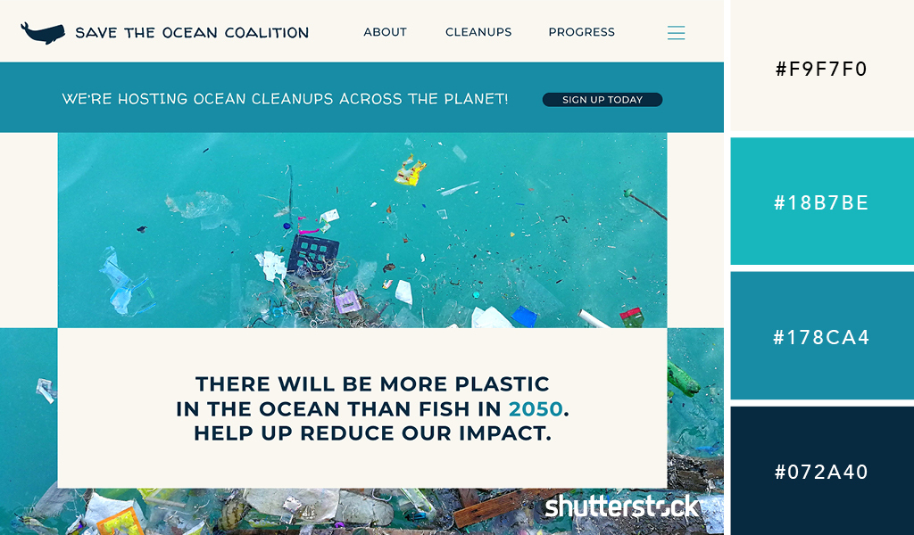
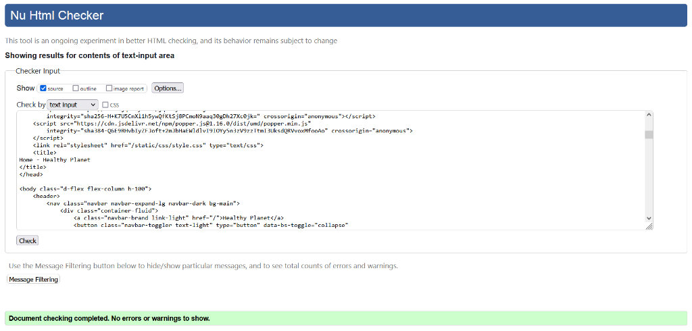
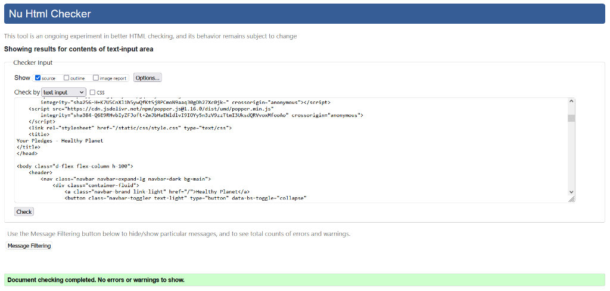

# Healthy Planet

## Code Institute EARTH DAY 2022 Hackathon
## Live Site

[Healthy Planet](https://healthy-planet.herokuapp.com/) CMD/Control + Click to open in a new tab

## Github Repository

[Healthy Planet](https://github.com/debbiect246/healthy-planet)

***
## Contents
- [Purpose](#purpose)
- [Objective](#objective)
- [User Experience](#user-experience)
    - [User Stories](#user-stories)
    - [UXD User Experience Design](#uxd-user-experience-design)
    - [Wireframes](#wireframes)
- [Features](#features)
    - [Current Features](#current-features)
    - [Features Left to Implement](#features-left-to-implement)
- [Technologies Used](#technologies-used)
    - [Languages](#languages)
    - [Other Technologies](#other-technologies)
- [Testing](#testing)
    - [Code Validation](#code-validation)
    - [Testing User Stories](#testing-user-stories)
        - [First Time Visitor Goals](#first-time-visitor-goals)
        - [Returning Visitor Goals](#returning-visitor-goals)
        - [Frequent User Goals](#frequent-user-goals)
    - [Further Testing](#further-testing)
    - [Lighthouse Results](#lighthouse-results)
        - [Mobile](#mobile)
        - [Desktop](#desktop)
- [Bugs](#bugs)
    - [Known Bugs](#known-bugs)
    - [Fixed Bugs](#fixed-bugs)
- [Deployment](#deployment)
    - [Github Pages](#github-pages)
- [Credits](#credits)
    - [Code](#code)
    - [Future Enhancements](#future enhancements)
    - [Acknowledgements](#acknowledgements)
***

## Purpose

The purpose of this project is to work together in a small Agile team, to build a web application relating to Code Institutes Earth Day 2022 Hackathon

## Objective

Healthy Planet is a small project aimed to educate and entertain users wiith facts and games relating to Earth Day and how you can do your bit to improve the planets health. The main feature of the project is an interactive quiz to test users' knowledge on plastic recycling best practices. The site also features some truths and myths about recycling, along with stories of how people have done their bit for the planet.

## User Experience

-   ### User stories

        1. As a user of plastic, I want to learn about how plastic is polluting the environment, so that I can educate myself on my environmental impact.
        2. As a person who doesn't think I can help the environment, I want to see inspiring stories about how plastic is being recycled and reused in the world, so that I too can help in some way.
        3. As a quiz lover, I'd like to test out the knowledge I have learned on the site, so see how much I remember.
        4. As a person who struggles to commit to changes, I'd like some accountability and ideas as to how I can help the environment.
        5. As a forgetful person, I'd like the above pledges to be emailed to me to help me keep track of them.
-   ### UXD User Experience Design

    -   #### Colour Scheme
        Though not all about the ocean, a significant portion of plastic waste ends up in the sea, therefore a mix of blue tones with an off white brings the project together and keeps it's theme well.

        
    -   #### Typography
        [Roboto](https://fonts.google.com/specimen/Roboto) was used throughout the site for its clear style, and well established use.

-   ### Wireframes
    - [Wireframes - Seperate Document](healthyplanet/static/readme-content/wireframes.md)

## Features

### Current Features

- [Features - Seperate Document](healthyplanet/static/readme-content/features.md)
### Features Left to Implement

We thought about how to improve the app.  Some ideas were:
1.  To have an authentication system so that users pledges could be stored there for retrieval later.
2.  To have a profile for each user so that they could see the pledges they had made over a set time period.
3.  Add automated testing maybe using unit testing module in python.

## Technologies Used

* We used the [Flask](https://flask.palletsprojects.com/) framework for handling REST API calls

### Languages

* We used[bootstrap 5](https://getbootstrap.com/) for responsiveness.
  
* generating web pages from HTML templates with [Jinja](https://jinja.palletsprojects.com/) 

* [python ](https://www.python.org/)is a programming language widely used on the internet with web frameworks to create apps.

* [html ](https://devdocs.io/html/)stands for HyperText MarkUp Language and is used to put content and structure on a web page.

* [CSS](https://devdocs.io/css/) stands for cascading style sheets and is used to style a webpage.

* [Javascript ](https://www.w3schools.com/js/DEFAULT.asp)is used to implement interactivity on the site.

## Testing

All testing was done manually.

### Code Validation

HTML code was validated using the  W3C [HTML Validator](https://validator.w3.org/nu/).

|         Page         |                                      Screenshot                                     |
|:--------------------:|:-----------------------------------------------------------------------------------:|
| Home Page            |             |
| Plastic Facts Page   |    |
| Pledges Page         |          |
| Your Pledges Page    |             |
| Quiz Page            |  |
| Success Stories Page |     |

HTML validation returned no errors. The quiz page returned three warnings, but these are related to elements of the page which are empty to start with but have content added later using javascript.

### Manual Testing

As each person coded part of a page or feature they tested it displayed as correctly or worked as planned.  Others in the group were also able to verify that each feature worked as planned and that the site displayed as planned.

### Further Testing

## Deployment

Deployment was done successfully using heroku.  The deployment process is outlined below.  However due to issues with heroky we were unable to use automatic deployment in heroku so Rocky periodically needed to push the code to heroku.

### Heroku

- Navigate to your [heroku dashboard](https://dashboard.heroku.com/apps)
- Click "New" and select "Create new app".  
- Input a meaningful name for your app and choose the region best suited to
  your location.
- Select "Settings" from the tabs.
  - Click "Reveal Config Vars".
    ![Config vars button](
  - Input `PORT` and `8000` as one config var and click add. 
- Select "Resources" from the tabs.
    1. Select "Heroku Postgres
    1. Choose your desired plan name from the dropdown
    1. Click "Submit Order Form"
    1. Your add on should appear in the list
    1. Now search for "Heroku Redis" and follow steps 2-4.
- Select "Deploy" from the tabs.  
  - Select "GitHub - Connect to GitHub" from deployment methods.  
  - Click "Connect to GitHub" in the created section.  
  - Search for the GitHub repository by name.  
  - Click to connect to the relevant repo.  
  - Either click `Enable Automatic Deploys` for automatic deploys or `Deploy
    Branch` to deploy manually. Manually deployed branches will need
    re-deploying each time the repo is updated. Automatic will build the app
    each time you use you add, commit and push new code.
  - Click `View` to view the deployed site.

The site is now live and operational

---

## Credits

Credits for images used are shown below.
1.  Hero image Photo by Naja Bertolt Jensen on Unsplash garbage and fish in sea
2.  Photo by Antoine GIRET on Unsplash     garbage on beach with goats
3.  Photo by Naja Bertolt Jensen on Unsplash   garbage and fish in sea
4.  Photo by Brian Yurasits on Unsplash   man holding plastic bottle on beach
5.  Photo by Fateme Alaie on Unsplash  planet earth in our hands
6.  Photo by Markus Spiske on Unsplash  no planet B
7.  Photo by Photo Boards on Unsplash  planet earth first
8.  Photo by Markus Spiske on Unsplash  not easy being green
9.  Photo by aitoff on pixabay of [plastic bottle in water](https://pixabay.com/photos/bottle-waste-pollution-garbage-2349126/) 

### Code

Code was written by different team members and different aspects as shown.
1.  Rocky got the repo up initially, later the repo was transferred to Debbie.  This was done by setting up a new github repo and adding collaborators.  Collaborators then cloned the repo and set it as remote.  Collaborators could then work on their code and issue pull requests when each feature was ready to be merged into the main branch.

2.  Rocky deployed the site to heroku and periodically pushed code to heroku as there were issues at heroku's end with automatic deployment.
During the hackathon automatic deployment to heroku was not available so Rocky periodically pushed code from the repo onto github, so there was a delay between pull requests being pushed to the repo and then being deployed to the live app.

3.  Tom worked on the quiz page using javascript. Rocky helping to fix a couple of bugs relating to displaying the results properly. Liam added modals to show answer feedback between each question.

4.  Liam worked on the plastic facts and success stories pages. The layouts for these pages were designed using the Bootstrap 5 framework classes and some custom CSS. Interactive graphs on the plastic facts page were implemented in Javascript using the [Chart.js](https://www.chartjs.org/) library. The [ChartJS Deferred Plugin](https://github.com/chartjs/chartjs-plugin-deferred) was used to delay chart initialization animations until visible. The SVG vector illustrations were drawn using [Affinity Designer](https://affinity.serif.com/en-gb/designer/).

5.  Debbie worked on the wireframes using [balsamiq](https://balsamiq.com/wireframes/) and pledges page.  The logic for the pledges page was added into the routes.py file which Rocky had set up initially then a form was added to pledges.html and a pledgesresult.html file was added to display the pledges made by the user to the user on a separate page.  Tom and Rocky helped with the logic for the pledges and thanks especially to Rocky for coming up with the most elegant and effective way of getting the back end data to the frond end.

6.  Rocky worked on responsiveness, checking that all pages were responsive and that images on the screen were the correct size and displayed well.  

7.  Rocky worked on the home page adding text and images.

8.  All members of the group were involved in checking that the functionality worked and in updating the readme periodically and helping each other with coding issues along the way.

9.  Shiba started out in the group initially adding ideas for the app but had to leave on day 2 due to having other commitments.

### Future Enhancements

1.  Add log in functionality to the app so that each user can keep track of their pledges.
2.  Connect the app to a database to store user details and pledges.
3.  Add a blog so that users can share environmental stories and upload images.
4.  Add automatic testing and continuous integration.
5.  Add a contact form so that users can contact developers with ideas for improvement.

### Acknowledgements

Many thanks to [Code Institute](https://codeinstitute.net/) for arranging this hackathon on the theme of [Earth Day](https://www.earthday.org/).  It has been a great learning opportunity for all the team and as a team we have all learnt new ways of working and new things.
